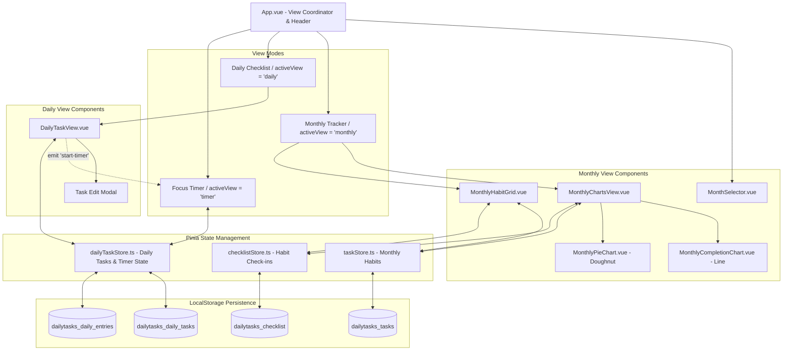

# Project Architecture: Daily Tasks

This document details the system architecture, component hierarchy, data flow, and storage mechanism of the **Daily Tasks** web application.

---

## 1. System Architecture Overview

---

## 2. Component Subsystems

### 2.1. `App.vue` (Root Coordinator)
- **Role:** Coordinates the top-level active view (`activeView: 'monthly' | 'daily' | 'timer'`), current month/year selection (`selectedMonthYear: { year, month }`), the highlighted day for the daily pie chart (`selectedDayNum`), and the storage capacity config modal state (`isConfigOpen`).
- **UI:** Minimal top header containing the view mode switcher buttons, embedded `MonthSelector`, and the real-time **Storage Capacity Button** (`StorageConfigModal.vue`) displaying used % of browser storage.

### 2.2. Monthly Habit Tracker Group
1. **`MonthSelector.vue`:**
   - Previous/next month navigation buttons and two native `<select>` dropdowns for month (1–12) and year.
2. **`MonthlyChartsView.vue`:**
   - Aggregates habit completion rates for each day of the selected month.
   - Houses three chart widgets:
     - Line Chart (`MonthlyCompletionChart.vue`): Daily average completion curve from day 1 to end of the month.
     - Selected Day Doughnut (`MonthlyPieChart.vue`): Completion percentage for `selectedDayNum`.
     - Monthly Performance Doughnut (`MonthlyPieChart.vue`): Overall month completion rate.
3. **`MonthlyHabitGrid.vue`:**
   - 2D Habit Matrix: Habits (rows) × Days in month (columns).
   - Sticky grid layout: Sticky left column for habit titles, sticky top header for day numbers, sticky right column for individual habit month %, and sticky footer for daily total checks.
   - Supports inline task renaming on double-click and quick-add row.

### 2.3. Daily Tasks Group
1. **`DailyTaskView.vue`:**
   - Date picker with Previous/Next day buttons and a "Today" shortcut.
   - Daily progress bar with dynamic completion percentage.
   - Task list with completion checkmarks, target duration display, and spent time.
   - Edit modal for updating title and target duration in minutes.
   - Timer launch button to switch to `TimerView`.

### 2.4. Focus Timer Group
1. **`TimerView.vue`:**
   - Dedicated dark interface (`bg-slate-900`).
   - Circular SVG progress ring:
     - **Countdown Mode** (when `duration` is set): Progress ring smoothly decreases based on remaining time.
     - **Stopwatch Mode** (when no `duration` is set): Continuous pulse ring indicator.
   - Automatically synchronizes `timeSpent` to `dailyTaskStore` every second.
   - Complete button (Check icon) finalizes elapsed time and marks the daily task as completed.

---

## 3. State Management & Storage Architecture

### 3.1. `useTaskStore` (`src/stores/taskStore.ts`)
- **State:** `tasks: Ref<Task[]>`
- **Purpose:** Manages the list of monthly recurring habits.
- **Actions:** `addTask(title)`, `updateTaskTitle(id, title)`, `updateTaskColor(id, color)`, `deleteTask(id)`.
- **LocalStorage:** Synced to `dailytasks_tasks`.

### 3.2. `useChecklistStore` (`src/stores/checklistStore.ts`)
- **State:** `entries: Ref<ChecklistEntry[]>`
- **Purpose:** Stores completion check-ins for monthly habits indexed by `taskId` and `date`.
- **Actions:** `toggleEntry(taskId, date)`, `deleteEntriesForTask(taskId)`.
- **LocalStorage:** Synced to `dailytasks_checklist`.

### 3.3. `useDailyTaskStore` (`src/stores/dailyTaskStore.ts`)
- **State:** `tasks: Ref<Task[]>`, `entries: Ref<ChecklistEntry[]>`
- **Purpose:** Manages date-specific daily tasks, target durations, and spent focus time.
- **Actions:** `addTask(title, dateStr?)`, `updateTask(id, updates)`, `deleteTask(id)`, `toggleEntry(taskId, date)`.
- **LocalStorage:** Synced to `dailytasks_daily_tasks` and `dailytasks_daily_entries`.
